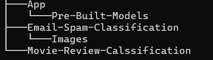
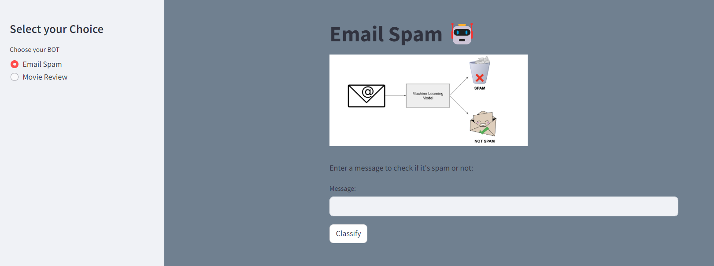
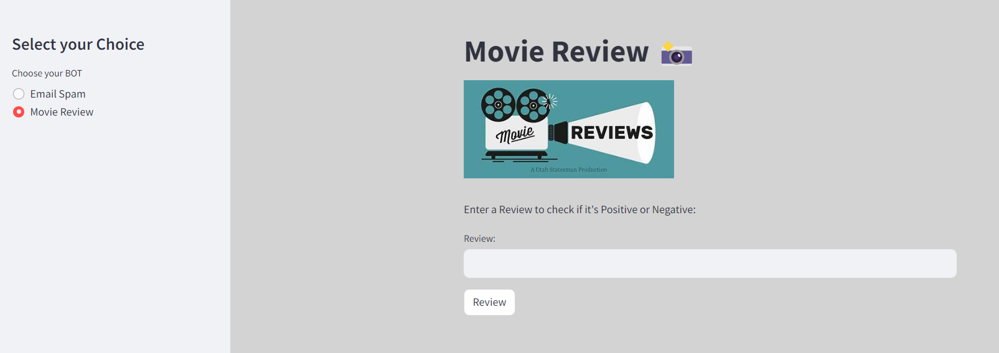

# Deep Learning -Text-Classify

Deep Learning (DL): 🤖
TensorFlow: 🔧
Keras: 🧩
Text Classification: 📝
Model Saving: 💾
Streamlit: 🌐

# Table of Contents

- [Overview](#overview)
- [Project Highlights](#Project-Highlights)
- [Installation](#Installation)
- [Usage](#Usage)
- [Sample Questions](#Sample-Questions)
- [Contribution](#contribution)
- [License](#license)
- [Contact](#contact)

## Overview 
In this project, we've harnessed the power of deep learning to tackle the fascinating task of text classification. 
Whether it's categorizing emails or analyzing movie reviews, our approach leverages Recurrent Neural Networks (RNNs) and Long Short-Term Memory networks (LSTMs) 
to accurately interpret and classify text data.


  
## Project Highlights

**Key Features:**

- Email Classification:
   Sorting emails into categories like spam or ham. This helps in managing inboxes efficiently and ensures important messages aren't missed.



- Movie Review Sentiment Analysis:
   Determining the sentiment behind movie reviews, whether positive or negative. This provides valuable insights into audience reactions and trends.



## Installation

1. Clone this repository to your local machine using:

```bash
  git clone https://github.com/alexvatti/DL-Text-Classify.git
```
2. Navigate to the project directory:

```bash
  cd DL-Text-Classify
```
3. Install the required dependencies using pip:

```bash
  pip install -r requirements.txt
```

4. Open the Jupyter Notebook - Run the Code

```   
Email-Spam-Classification/RNN_Emails_Spam_Classification.ipynb
```

```
Movie-Review-Calssification/Movie-Review-Classification.ipynb
```

## Usage

1. Run the Streamlit app by executing:
```bash
cd App
streamlit run app.py
```

2.The web app will open in your browser where you can ask questions

## Sample Questions

**Movie Review**
- I thought this was a wonderful way to spend time on a too hot summer weekend, sitting in the air conditioned theater and watching a light-hearted comedy. The plot is simplistic, but the dialogue is witty and the characters are likable (even the well bread suspected serial killer). While some may be disappointed when they realize this is not Match Point 2: Risk Addiction, I thought it was proof that Woody Allen is still fully in control of the style many of us have grown to love.<br /><br />This was the most I'd laughed at one of Woody's comedies in years (dare I say a decade?). While I've never been impressed with Scarlet Johanson, in this she managed to tone down her "sexy" image and jumped right into a average, but spirited young woman.<br /><br />This may not be the crown jewel of his career, but it was wittier than "Devil Wears Prada" and more interesting than "Superman" a great comedy to go see with friends.

- This show was an amazing, fresh & innovative idea in the 70's when it first aired. The first 7 or 8 years were brilliant, but things dropped off after that. By 1990, the show was not really funny anymore, and it's continued its decline further to the complete waste of time it is today.<br /><br />It's truly disgraceful how far this show has fallen. The writing is painfully bad, the performances are almost as bad - if not for the mildly entertaining respite of the guest-hosts, this show probably wouldn't still be on the air. I find it so hard to believe that the same creator that hand-selected the original cast also chose the band of hacks that followed. How can one recognize such brilliance and then see fit to replace it with such mediocrity? I felt I must give 2 stars out of respect for the original cast that made this show such a huge success. As it is now, the show is just awful. I can't believe it's still on the air.

**Email**
- XXXMobileMovieClub: To use your credit, click the WAP link in the next txt message or click here>> http://wap. xxxmobilemovieclub.com?n=QJKGIGHJJGCBL

- I'm gonna be home soon and i don't want to talk about this stuff anymore tonight, k? I've cried enough today.

- England v Macedonia - dont miss the goals/team news. Txt ur national team to 87077 eg ENGLAND to 87077 Try:WALES, SCOTLAND 4txt/ú1.20 POBOXox36504W45WQ 16+

## Contribution

Feel free to contribute and enhance the project!

## License
This project is licensed under the [MIT License](LICENSE).

## Contact
For any inquiries or issues, please contact Alex at alexvatti@gmail.com
